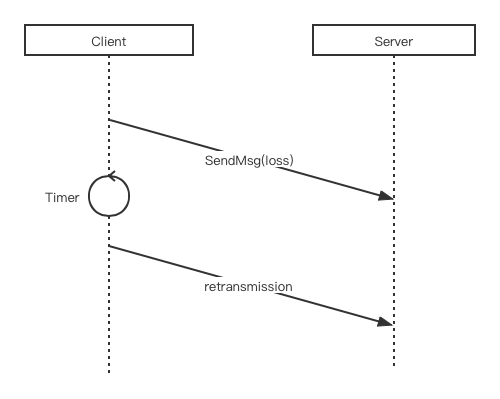
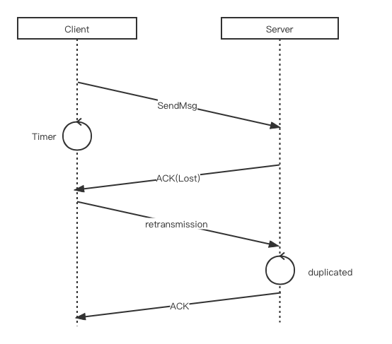
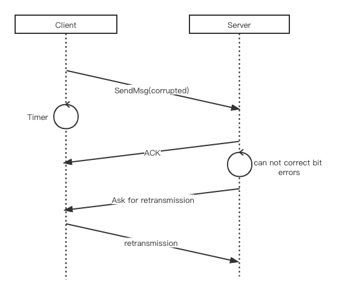
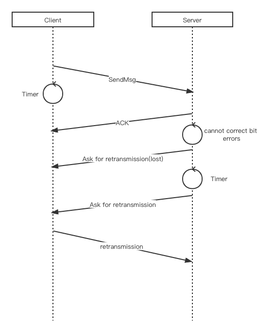

This document talks about how we design and implement the transmission control, including retransmission mechanism and forward error control.

### Retransmission Mechanism

Due to interference or channel fading, bit errors could occur in the received packets. And we are operating directly on MAC layer, so retransmission is needed. This mechanism is based on Weize's work -- `unicast_client.c` and `unicast_server.c`. I will encapsulate some function on this base and provide seamless APIs for other guys who working on Application layer to use.

Then I will talk about when we actually need retransmission.

1. When the message is totally lost or currupted in channel, the server didn't receive it at all. This will trigger a timeout on client side. When the timer is count down to zero but still not receive ACK from server, client will retransmission this message.

2. Another senario is when Server's Acknowledgement is lost, this will still trigger a retransmission on client. In this case, Server will receive a duplicated packet and ignore it, but send another ACK back to client.

3. When Server did receive the message, but the error rate has exceed the maximum correction capacity. Then server will send a packet to ask client to retransmit this packet.

4. In senario above, if Server ask for retransmission, but this message fail/lost. There is a timer in server side. If Client didn't retransmit in this time, Server needs to re-send the "Ask for retransmission" message until Server receive correct packet.

### Forward Error Control

Instead of retransmission everytime when there's some bit error, we can also implement redundency codes for detect and correct the bit errors. We use Hamming code to do this job, which add one more byte redundency after two-bytes payload.